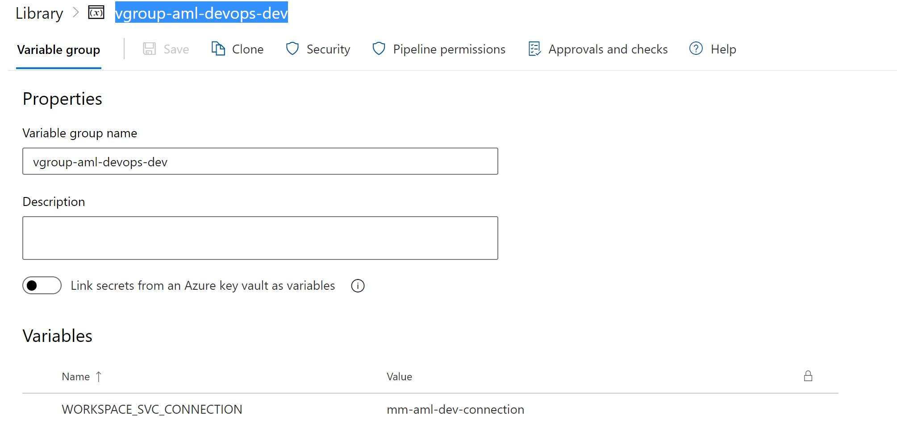
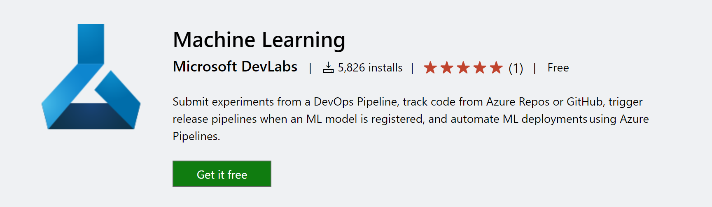
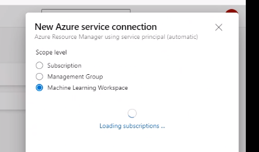
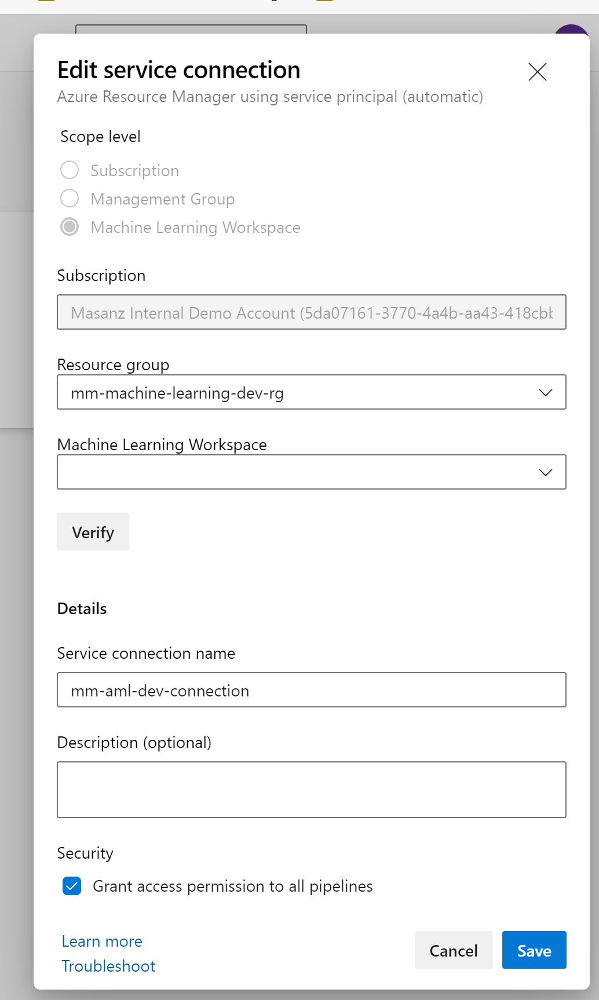

Folder Overview
---------------

-   01_LocalDevelopment: No automation – does not include MLOps capabilties

    -   LocalTraining.ipynb : Example Notebook for creating a model and
        deploying a rest endpoint

-   02_RemotePipeline

    -   00_PipeLinePrep.ipynb : Notebook to take data out of folder and place in
        default blob storage

    -   01_PipelineCreation.ipynb : Notebook to create Azure ML Pipeline for
        Model Training

    -   02_Inference_Pipeline_ConsumeModel.ipynb: Notebook to create Azure ML
        Pipeline for Model Inferecing

-   03_devopspipeline

    -   00_DevOpsPipelineSetup.ipynb: Sets up an environment variable – update
        your AzureDevOps

>   If you don’t want to run this pipeline, then you can manually create the
>   variable group

>   Graphical user interface, text, application, email Description automatically
>   generated

-   00_setup_devOps_environment.yml

-   01_publish_train_register_pipeline.yml

-   DEV-devOps-variables-template.yml

>   Prerequisites:

>   Got to marketplace.visualstduio.com and install from the marketplace

>   Graphical user interface, text, application Description automatically
>   generated

>   Create an Azure ML Workspace Connection

>   Graphical user interface, application Description automatically generated

>   This is set to: mm-aml-dev-connection in your environment variable group.

>   Graphical user interface, text, application, email Description automatically
>   generated
